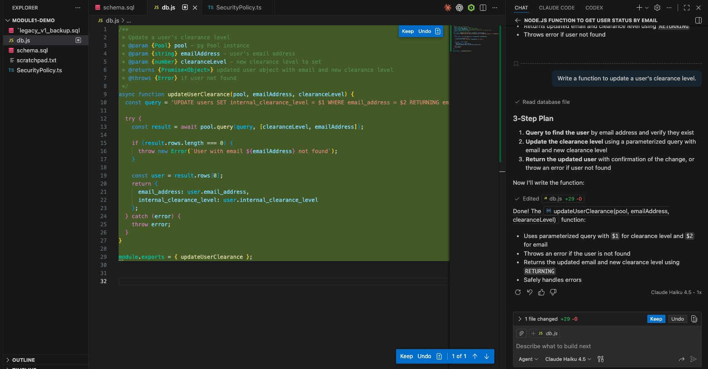
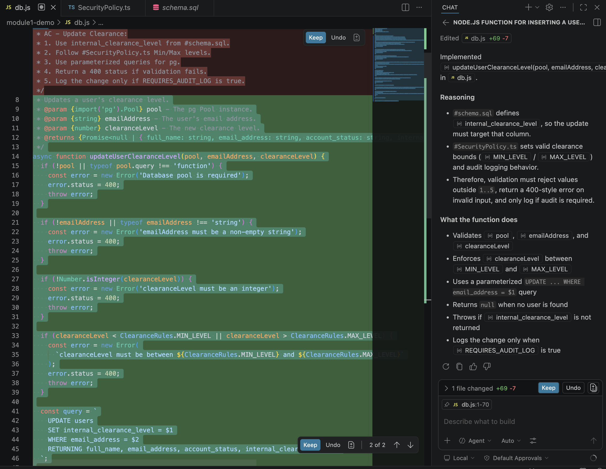

# Exercise Solution - Prompting Foundations - 1

This file summarizes what learners should observe from the exercise outputs.

---

# Part A - Prompt A Output

Prompt used:

```text
Write a function to update a user's clearance level.
```

## Expected output

- Copilot creates a working update function that uses internal_clearance_level, a parameterized query, and a user-not-found check.

- Because Prompt A does not mention SecurityPolicy.ts, the code does not enforce min/max clearance rules or audit logging behavior.

- Note: The generated output may slightly vary due to non deterministic nature of LLM and less informative prompt




---

# Part B - Prompt B Output


Acceptance criteria block:

```javascript
/**
 * AC - Update Clearance:
 * 1. Use internal_clearance_level from #schema.sql.
 * 2. Follow #SecurityPolicy.ts Min/Max levels.
 * 3. Use parameterized queries for pg.
 * 4. Return a 400 status if validation fails.
 * 5. Log the change only if REQUIRES_AUDIT_LOG is true.
 */
```

Prompt used:

```text
Reason through how #SecurityPolicy.ts changes validation for #schema.sql, then implement the function following all 5 AC points.
```

## Expected output

- Prompt A is a broad request, so the requirements are implied.

- Prompt B is AC-encoded, so validation rules, audit behavior, and implementation expectations are stated before code is generated.

- Note: The generated output may slightly vary due to non deterministic nature of LLM and less informative prompt



---

